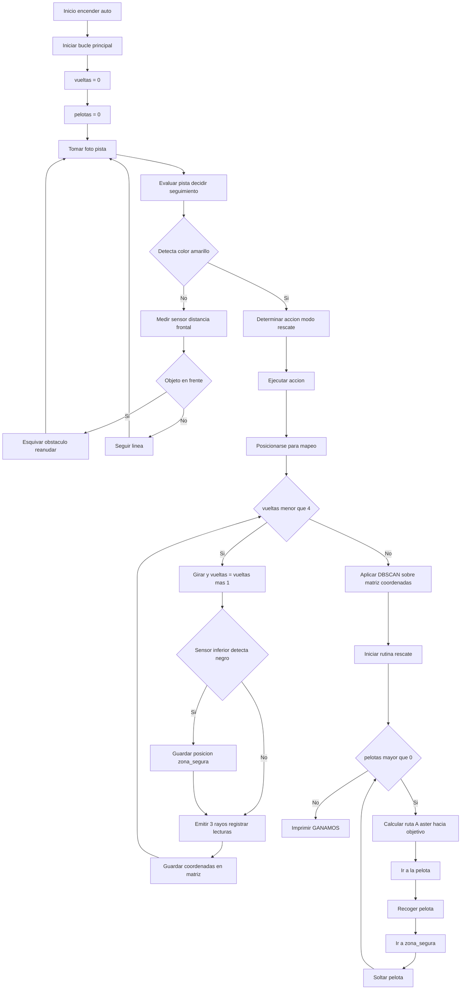

```mermaid
flowchart TD
  %% Initialization Phase
  subgraph Init_Phase ["Initialization"]
    Start([Inicio])
    Start --> Init[Inicializar parametros<br/>HSV_THRESHOLDS MIN_RATIO<br/>MORPH_KERNEL USE_MEDIAN_BLUR<br/>BLUR_KSIZE CAM_INDEXS DEBUG]
    Init --> OpenCam{Abrir camara con CAM_INDEXS}
    OpenCam -- fallo --> EndErr([Fin error abrir camara])
  end

  %% Main Processing Loop
  subgraph Main_Loop ["Main Processing Loop"]
    OpenCam -- exito --> FrameLoop[Loop por cada frame]
    FrameLoop --> ReadFrame{Leer frame}
    ReadFrame -- no --> EndCapture([Fin error captura])
    ReadFrame -- si --> ToHSV[Convertir frame BGR a HSV]
    ToHSV --> ForEachSeg[Iterar segmentos<br/>segmento1 hasta segmento5]
  end

  %% Segment Processing
  subgraph Segment_Processing ["Segment Processing"]
    ForEachSeg --> Clamp[Clamp coords al tamaño del frame]
    Clamp --> ValidCoords{Coords validas}
    ValidCoords -- no --> ReturnIndef[Retornar indefinido 0]
    ValidCoords -- si --> Crop[Recortar ROI]

    Crop --> MaybeBlur{Aplicar medianBlur?}
    MaybeBlur -- si --> ApplyBlur[Aplicar medianBlur con BLUR_KSIZE]
    MaybeBlur -- no --> NoBlur[No aplicar blur]
    ApplyBlur --> Kernel[Crear kernel morfologico con MORPH_KERNEL]
    NoBlur --> Kernel
  end

  %% Color Detection
  subgraph Color_Detection ["Color Detection"]
    Kernel --> ForEachColor[Para cada color en HSV_THRESHOLDS]
    ForEachColor --> InRange[mask igual inRange de roi low high]
    InRange --> MorphOpen[mask igual morphologyEx OPEN]
    MorphOpen --> Count[count igual countNonZero de mask]
    Count --> Ratio[ratio igual count dividido area_ROI]
    Ratio --> BestCheck{ratio mayor que best_ratio?}
    BestCheck -- si --> UpdateBest[Actualizar best_color y best_ratio]
    BestCheck -- no --> NextColor[Continuar siguiente color]
    UpdateBest --> NextColor

    NextColor --> MoreColors{Quedan colores?}
    MoreColors -- si --> ForEachColor
    MoreColors -- no --> CheckMin{best_ratio mayor igual MIN_RATIO?}
    CheckMin -- si --> ReturnColor[Retornar best_color y best_ratio]
    CheckMin -- no --> ReturnIndef2[Retornar indefinido y best_ratio]
  end

  %% Decision Logic
  subgraph Decision_Logic ["Decision Logic"]
    ReturnColor --> CollectResults[Recolectar resultados por segmento<br/>c1 c2 c3 c4 c5 y ratios]
    ReturnIndef2 --> CollectResults
    ReturnIndef --> CollectResults

    CollectResults --> Seg4Flag[Calcular seg4_flag<br/>segmento4 es negro o verde<br/>OR segmento5 es negro o verde]
    Seg4Flag --> DecisionTuple[Formar tupla c1 c2 c3 seg4_flag]
    DecisionTuple --> MatchCase[Evaluar match case]

    MatchCase --> Case1{c1 es verde y c2 es verde}
    Case1 -- si --> ActionBACK[accion atras]
    Case1 -- no --> Case2{c1 es verde y seg4_flag es False}
    Case2 -- si --> ActionLeftAdjust[accion izquierdaYAjuste]
    Case2 -- no --> Case3{c2 es verde y seg4_flag es False}
    Case3 -- si --> ActionRightAdjust[accion derechaYAjuste]
    Case3 -- no --> Case4{c3 es negro y c1 y c2 no son verdes}
    Case4 -- si --> ActionForward[accion adelante]
    Case4 -- no --> Case5{c3 es negro y c1 es verde y seg4_flag es False}
    Case5 -- si --> ActionLeftAdjust
    Case5 -- no --> Case6{c3 es negro y c2 es verde y seg4_flag es False}
    Case6 -- si --> ActionRightAdjust
    Case6 -- no --> Case7{c1 es blanco y c2 es blanco}
    Case7 -- si --> ActionForward
    Case7 -- no --> Case8{c1 es negro y c2 es blanco}
    Case8 -- si --> ActionLeft[accion izquierda]
    Case8 -- no --> Case9{c1 es blanco y c2 es negro}
    Case9 -- si --> ActionRight[accion derecha]
    Case9 -- no --> DefaultAction[accion adelante fallback]
  end

  %% Action Execution
  subgraph Action_Execution ["Action Execution"]
    ActionBACK --> Emit[Emitir accion unica por ciclo]
    ActionLeftAdjust --> Emit
    ActionRightAdjust --> Emit
    ActionForward --> Emit
    ActionLeft --> Emit
    ActionRight --> Emit
    DefaultAction --> Emit

    Emit --> FrameLoop
  end
```

```mermaid
flowchart TD
  %% Inicio y variables
  start[Inicio encender auto]
  iniciar_bucle[Iniciar bucle principal]
  vueltas_init[vueltas = 0]
  pelotas_init[pelotas = 0]

  %% Percepcion y seguimiento
  tomar_foto[Tomar foto pista]
  evaluar_pista[Evaluar pista decidir seguimiento]
  detectar_amarillo{Detecta color amarillo}
  accion_modo[Determinar accion modo rescate]
  ejecutar_accion[Ejecutar accion]
  medir_dist[Medir sensor distancia frontal]
  obj_frente{Objeto en frente}
  esquivar[Esquivar obstaculo reanudar]
  seguir_linea[Seguir linea]

  %% Mapeo
  posicionarse[Posicionarse para mapeo]
  cond_vueltas{vueltas menor que 4}
  girar[Girar y vueltas = vueltas mas 1]
  sensor_abajo{Sensor inferior detecta negro}
  guardar_zona[Guardar posicion zona_segura]
  emitir_rayos[Emitir 3 rayos registrar lecturas]
  guardar_coords[Guardar coordenadas en matriz]
  aplicar_dbscan[Aplicar DBSCAN sobre matriz coordenadas]

  %% Rescate
  iniciar_rescate[Iniciar rutina rescate]
  pelotas_cond{pelotas mayor que 0}
  calcular_ruta[Calcular ruta A aster hacia objetivo]
  ir_pelota[Ir a la pelota]
  recoger[Recoger pelota]
  ir_zona[Ir a zona_segura]
  soltar[Soltar pelota]
  imprimir[Imprimir GANAMOS]

  %% Flujo principal
  start --> iniciar_bucle
  iniciar_bucle --> vueltas_init
  vueltas_init --> pelotas_init
  pelotas_init --> tomar_foto

  %% Bucle de toma de foto y decision frontal
  tomar_foto --> evaluar_pista
  evaluar_pista --> detectar_amarillo
  detectar_amarillo -->|Si| accion_modo
  accion_modo --> ejecutar_accion
  ejecutar_accion --> posicionarse
  detectar_amarillo -->|No| medir_dist

  medir_dist --> obj_frente
  obj_frente -->|Si| esquivar
  esquivar --> tomar_foto
  obj_frente -->|No| seguir_linea
  seguir_linea --> tomar_foto

  %% Mapeo
  posicionarse --> cond_vueltas
  cond_vueltas -->|Si| girar
  girar --> sensor_abajo
  sensor_abajo -->|Si| guardar_zona
  sensor_abajo -->|No| emitir_rayos
  guardar_zona --> emitir_rayos
  emitir_rayos --> guardar_coords
  guardar_coords --> cond_vueltas
  cond_vueltas -->|No| aplicar_dbscan
  aplicar_dbscan --> iniciar_rescate

  %% Rescate
  iniciar_rescate --> pelotas_cond
  pelotas_cond -->|Si| calcular_ruta
  calcular_ruta --> ir_pelota
  ir_pelota --> recoger
  recoger --> ir_zona
  ir_zona --> soltar
  soltar --> pelotas_cond
  pelotas_cond -->|No| imprimir
```